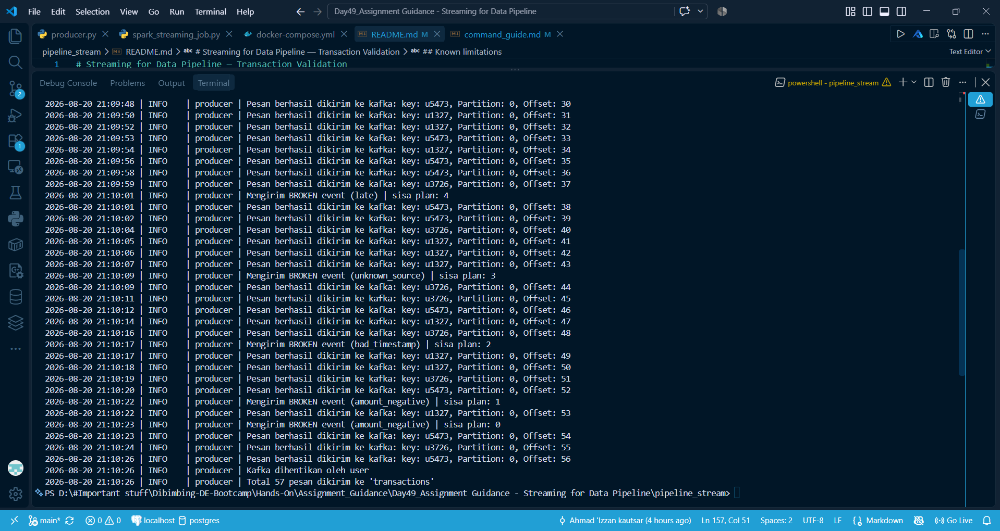
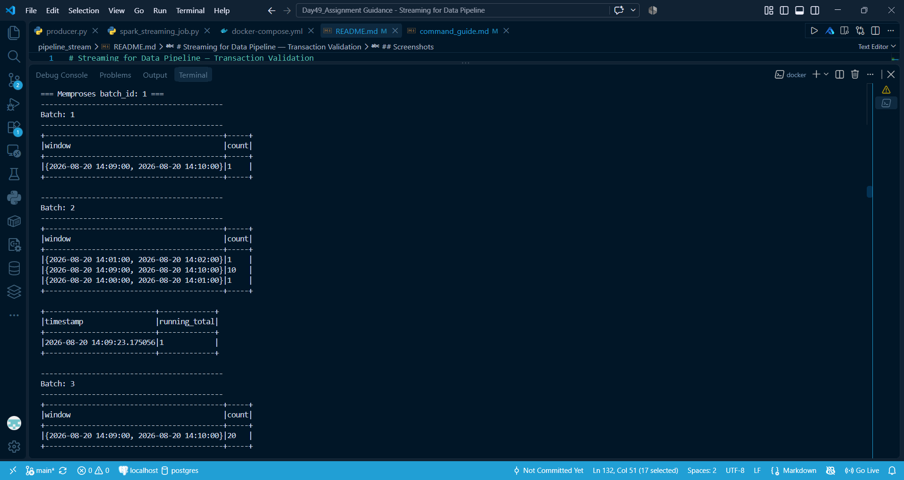
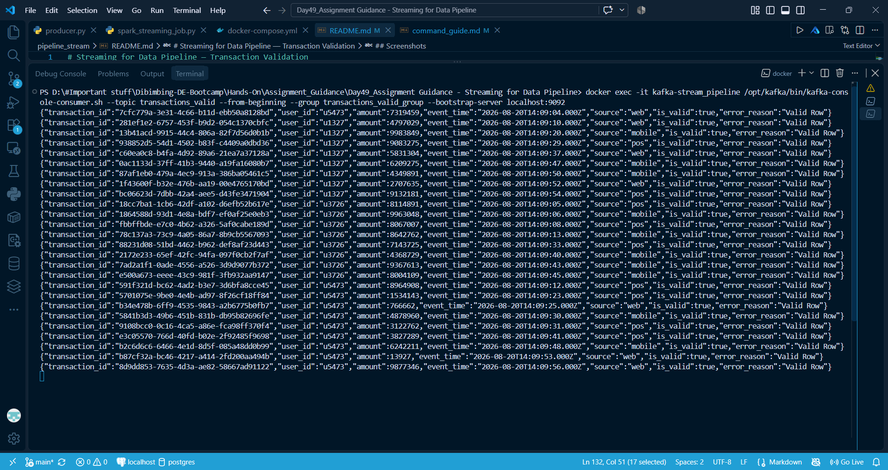
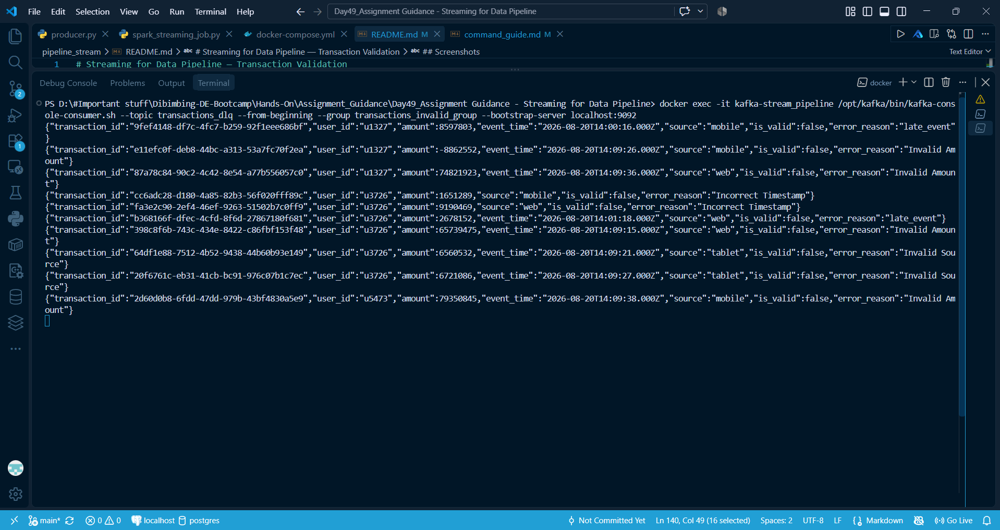

# Streaming for Data Pipeline — Transaction Validation

Real-time transaction validation pipeline: Kafka producer generates transaction
events (valid + intentionally broken), Spark Structured Streaming consumes,
validates, and routes them to `transactions_valid` or `transactions_dlq`.

## Architecture

```
producer.py --> [transactions] --> spark_streaming_job.py --> [transactions_valid]
                                                            --> [transactions_dlq]
                                                            --> console (window count + running total)
```

## Structure

```
/producer/
    producer.py
/streaming/
    spark_streaming_job.py
docker-compose.yml
README.md
```

## Stack

- Kafka broker: `apache/kafka:4.2.1` (Docker)
- Producer: Python, `confluent-kafka`
- Streaming: PySpark 4.1.2 (Docker, `spark:python3` image), Spark Structured Streaming
- Kafka connector: `org.apache.spark:spark-sql-kafka-0-10_2.13:4.1.2`

## Event schema

```json
{
  "transaction_id": "uuid",
  "user_id": "string",
  "amount": "integer",
  "timestamp": "string, ISO 8601 (yyyy-MM-ddTHH:mm:ssZ)",
  "source": "mobile | web | pos"
}
```

## Producer behaviour

- Sends one event every 1–2 seconds to topic `transactions`.
- Maintains a shuffled queue of 15 broken events (3x each of the 5 kinds below),
  drawn with 30% probability per iteration so broken events are interspersed
  with valid ones rather than sent in a single burst.
- Broken event kinds: `amount_negative`, `amount_too_large`, `bad_timestamp`
  (empty string), `unknown_source`, `late` (timestamp set 4–10 minutes in the past).
- Duplicate events are **not** generated by the producer (a deliberate scope
  cut given time constraints — see Known Limitations).

## Streaming job

Reads from `transactions`, parses JSON against a fixed schema, and converts
`timestamp` to `event_time` using `try_to_timestamp` (returns `null` on
unparseable input instead of failing the query, which `to_timestamp` does
under Spark's default ANSI mode).

### Validations (all row-level, run per micro-batch via `foreachBatch`)

| # | Check | Fails when |
|---|-------|-----------|
| 1 | Mandatory field | `user_id`, `amount`, or `timestamp` is null |
| 2 | Type / parse | `event_time` is null (timestamp failed to parse) |
| 3 | Range | `amount` not in 1 – 10,000,000 |
| 4 | Source | `source` not in `mobile`, `web`, `pos` |
| 5 | Duplicate | same `user_id` + `timestamp` appears more than once **within the same micro-batch** |
| 6 | Late | `event_time` more than 3 minutes behind current time |

A row failing any check gets `is_valid = false` and a single `error_reason`
(first match wins, in the order above — not a combined list, by design).
Valid rows go to `transactions_valid`, invalid rows to `transactions_dlq`.

### Watermark & windowing

`event_time` carries a 3-minute watermark, used **only** by the tumbling
window monitoring query (`groupBy(window(event_time, "1 minute")).count()`,
output to console). It bounds how long Spark keeps window state in memory —
it does not affect the validation path at all. The "late" check in the
validation table above is a separate, manually computed rule and runs
independently of the watermark.

### Console output

Two independent streaming queries write to console:
- Tumbling window: transaction count per 1-minute window (`update` mode).
- Running total: cumulative count of valid transactions since job start,
  printed as `(timestamp, running_total)` after each micro-batch.

## Running it

```bash
docker compose up -d

# create topics (once)
docker exec -it kafka-Introduction kafka-topics.sh --create --topic transactions --bootstrap-server localhost:9092 --partitions 1 --replication-factor 1
docker exec -it kafka-Introduction kafka-topics.sh --create --topic transactions_valid --bootstrap-server localhost:9092 --partitions 1 --replication-factor 1
docker exec -it kafka-Introduction kafka-topics.sh --create --topic transactions_dlq --bootstrap-server localhost:9092 --partitions 1 --replication-factor 1

# producer (native, outside Docker)
python producer/producer.py

# streaming job (inside the spark container)
docker exec -it spark-job bash
export PATH=$PATH:/opt/spark/bin
spark-submit --conf spark.jars.ivy=/tmp/.ivy2 \
  --packages org.apache.spark:spark-sql-kafka-0-10_2.13:4.1.2 \
  /opt/spark-apps/spark_streaming_job.py
```

Verify routing:
```bash
docker exec -it kafka-Introduction kafka-console-consumer.sh --topic transactions_valid --bootstrap-server localhost:9092 --from-beginning
docker exec -it kafka-Introduction kafka-console-consumer.sh --topic transactions_dlq --bootstrap-server localhost:9092 --from-beginning
```

## Screenshots

All screenshots are in `/screenshots/`.

**Kafka producer** — terminal running `producer.py`, showing successful
deliveries and broken events being sent (`sisa plan: 0` confirms all 15
broken events were sent).


**Streaming console output** — Spark console showing both the tumbling
window count per minute and the running total of valid transactions.


**Topic: transactions_valid** — `kafka-console-consumer` output confirming
valid rows landed in the valid topic.


**Topic: transactions_dlq** — `kafka-console-consumer` output confirming
invalid rows landed in the DLQ topic, each with an `error_reason`.


## Known limitations

- **Duplicate detection is intra-batch only.** It uses a `row_number()`
  window function inside `foreachBatch`, not `applyInPandasWithState`. Two
  identical `user_id` + `timestamp` events landing in *different*
  micro-batches will not be caught. The producer also does not generate
  duplicate events at all, so this path is untested against real pipeline
  data.
- **`running_total` is an in-memory Python variable**, not Spark-managed
  state. It resets to 0 if the job restarts — no checkpoint recovery for
  this specific value (the routing and window logic upstream do use
  checkpointing).
- **Mandatory field check (validation #1) is effectively unexercised** by
  the current producer — `broken_transaction()` corrupts field *values*,
  never sets a field to null, so this rule has no real test data behind it
  even though the logic itself is straightforward.